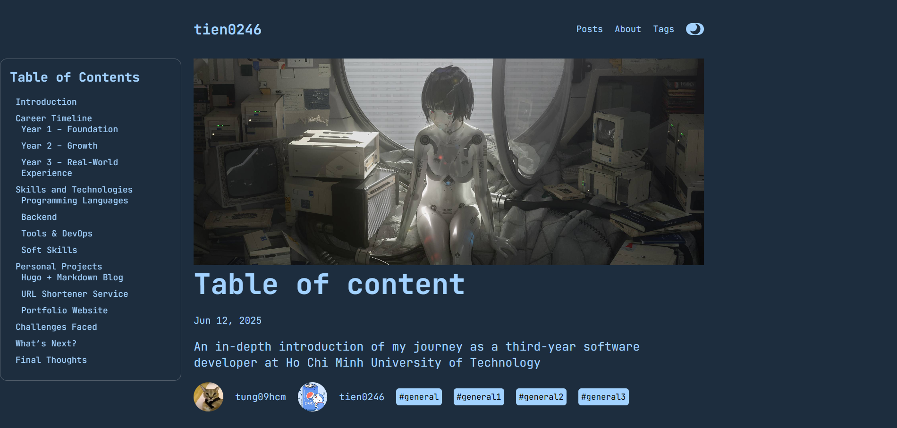

# CyberMonoX Hugo Blog

Welcome to **CyberMonoX**, a highly customized [Hugo](https://gohugo.io/) blog theme designed and built from scratch.
This project is more than just a theme — it's a secure, automated, and minimalistic publishing platform for developers.



---

## ✨ Features

* 🎨 **Custom Hugo Theme** — Clean, modern cyber-style layout. Built from scratch using only HTML/CSS.
* 🔒 **Password-Protected Posts** — Individual posts can be encrypted with AES and unlocked by readers.
* ⚙️ **GitHub Actions Workflow** — Automatically encrypts selected content and deploys to GitHub Pages.
* 📚 **Table of Contents** — Automatic ToC generation for long-form posts.
* 🌓 **Dark / Light Mode Toggle** — Fully supported.
* ⚡ **Fast & Lightweight** — No JS frameworks. Minimal assets, instant load.

---

## 🔐 Post Encryption

Posts can be protected with a password.
When the page loads, users will see a prompt to input the password.
If it matches, encrypted content is decrypted **client-side using AES**.

Useful for:

* Semi-private notes
* Internal documentation
* Selective sharing while still hosting publicly

---

## 🚀 Deployment Workflow (GitHub Actions)

The included workflow automatically:

1. Scans Markdown files for encryptable HTML blocks.
2. Encrypts those blocks.
3. Builds the static site using Hugo.
4. Deploys the final site to **GitHub Pages (`gh-pages` branch)**.

You just **write → commit → push**.
Encryption + deployment happen automatically.

---

## 🧑‍💻 Getting Started

### 1. Clone Repository

```bash
git clone https://github.com/tung09hcm/CyberMonoX.git
cd CyberMonoX
```

---

### 2. Run Locally

Make sure Hugo is installed:

```bash
hugo version
```

Run development server:

```bash
hugo server -D
```

Open browser:

```
http://localhost:1313
```

* `-D` shows draft posts
* Auto-reload enabled when editing files

---

### 3. Create a New Post

CyberMonoX allows creating new posts **after cloning and committing**.

Command:

```bash
hugo new post/TyC.md
```

This creates:

```
content/post/TyC.md
```

---

## 🧩 Default Post Template (Archetype)

You can customize the default structure of new posts at:

```
archetypes/default.md
```

Example:

```toml
+++
title = '{{ replace .File.ContentBaseName "-" " " | title }}'
date = {{ .Date }}
description = ""
image = ""
categories = ["general"]
authors = ["tung09hcm"]
avatar = ["/images/hecker.jpg"]
+++
```

Every new post created with `hugo new` will follow this template.

---

## 🛠 Tech Stack

* **Hugo** — Static Site Generator
* **CryptoJS** — AES Encryption
* **GitHub Actions** — CI/CD Pipeline
* **HTML / CSS** — Custom Theme

---

## 🙌 Author

Created and maintained by **@tung09hcm**

---

**CyberMonoX = Hugo + Security + Automation + Minimalism.**
